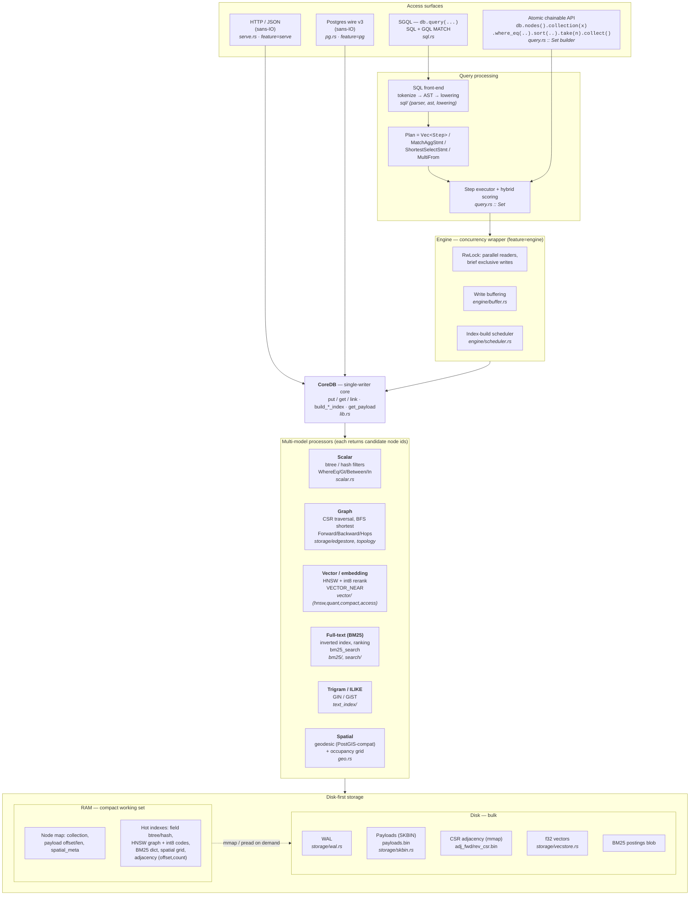
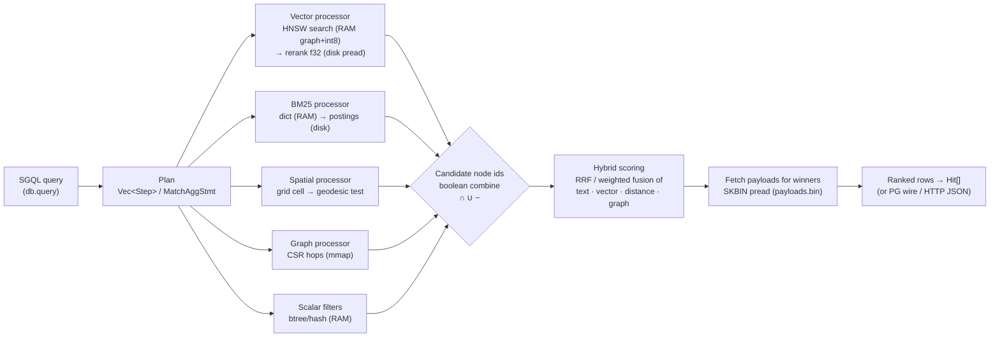
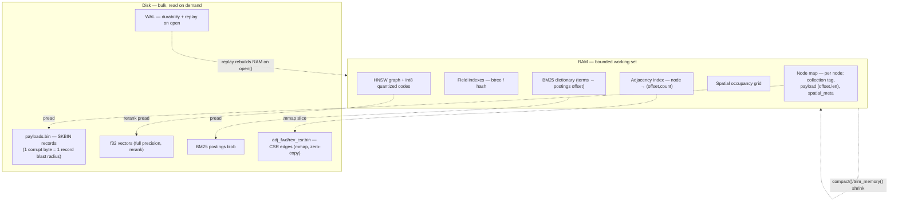

# Developer guide — architecture

How the engine is put together, in four diagrams, plus the repo map and the
reading order for the rest of this guide. Diagrams render directly on GitHub
(Mermaid); module names map to `src/`, so every box is a place you can read
the code.

Three terms used throughout:

- **SGQL** — the query surface: standard SQL everywhere, with standard GQL
  graph patterns inside `MATCH`. One statement can mix both.
- **disk-first** — bulk data (record payloads, full-precision vectors, text
  postings, edge lists) lives on disk; RAM holds only compact metadata and the
  hot index structures needed to find things fast. Memory stays bounded even
  when the dataset is much bigger than RAM.
- **candidate node ids** — every index family (scalar, graph, spatial, vector,
  text) answers the same way: with a set of node ids. That shared currency is
  what lets one query combine several retrieval models with plain boolean
  logic and then rank the survivors with one hybrid score.

---

## 1. Layered architecture (interfaces → query → engine/core → processors → storage)



---

## 2. Data flow of one hybrid query (candidate generation → combine → score)

How a single SGQL query fans out to processors and fuses their results. Example:
`SELECT ... FROM doc WHERE VECTOR_NEAR(emb, $q, 100) AND ST_DWithin(geo, $p, 5000)`
combined with a BM25 rank and a graph filter.



---

## 3. Disk-first split — what lives in RAM vs on disk

The thesis in one picture: RAM holds only compact metadata + hot index structures;
all bulk data is on disk and read on demand (mmap slices or `pread`).



---

## 4. Module map (directory → responsibility)

```mermaid
flowchart LR
  subgraph SRC["sekejap/src"]
    direction TB
    L["lib.rs — CoreDB core API"]
    QR["query.rs — Step enum, Set executor, Hit"]
    SQ["sql.rs + sql/ — SGQL front-end (parser, ast, lowering, executor)"]
    SC["scalar.rs — SQL scalar functions"]
    GE["geo.rs — geodesic spatial (PostGIS-compatible)"]

    subgraph M_ENG["engine/ (feature=engine)"]
      E1["mod, buffer, scheduler"]
      E2["guard, policy"]
    end
    subgraph M_VEC["vector/"]
      V1["hnsw, quant (int8 SQ)"]
      V2["compact (CSR disk graph), access"]
    end
    subgraph M_BM["bm25/ + search/"]
      B1["tokenizer, dict, postings, index"]
      B2["search: index, disk, ranking"]
    end
    subgraph M_TXT["text_index/"]
      T1["trigram, gin, gist, query"]
    end
    subgraph M_STO["storage/"]
      S1["wal, skbin (payloads)"]
      S2["edgestore, topology (graph)"]
      S3["vecstore, mmap"]
    end
    subgraph M_NET["network adapters (sans-IO)"]
      N1["serve.rs — HTTP/JSON (feature=serve)"]
      N2["pg.rs — Postgres wire v3 (feature=pg)"]
    end
  end
```



---

### Reading the diagrams

- **Many surfaces, one core.** The atomic API and SGQL run in-process;
  `serve` (HTTP) and `pg` (Postgres wire) are thin transports with no sockets
  of their own — the caller owns all I/O — and they call the same library
  service. However you reach it, there is one engine underneath.
- **The engine layer is optional.** `CoreDB` alone is a complete single-writer
  embedded database; the `engine` module only adds concurrency, write
  buffering, and caching on top. If you do not need those, you do not pay for
  them.
- **Composition is the point.** Each processor returns candidate node ids;
  boolean set logic combines them; hybrid scoring ranks what survives. That is
  how one statement can filter by scalar fields, walk the graph, match text,
  and rank by vector similarity at the same time.
- **The RAM/disk split (diagram 3) is the core promise.** The dashed arrows
  (positional reads, mmap slices) are how bulk data stays on disk until the
  moment it is needed.
- Feature-gated modules — `engine`, `serve`, `pg` — are opt-in: the
  minimal build is just the embedded core.

---

## Repo map

For a **per-file** index — every one of the 44 `src/` files with a one-line purpose
and how they connect — see [repo-map.md](repo-map.md). The tree below is the
directory-level summary.

```
sekejap/
├── src/
│   ├── lib.rs            CoreDB — the embedded core (open/put/get/link,
│   │                     index builds, compaction, recovery)
│   ├── query.rs          Step plan + Set executor + hybrid scoring
│   ├── sql.rs, sql/      SGQL front-end: tokenize → AST → lowering
│   ├── scalar.rs         SQL scalar functions
│   ├── geo.rs            geodesic spatial (PostGIS-compatible, metres)
│   ├── vector/           HNSW, int8 quantization, compact disk index
│   ├── bm25/             tokenizer, dictionary, postings, index
│   ├── search/           positional search + ranking
│   ├── text_index/       trigram GIN for ILIKE
│   ├── storage/          WAL, SKBIN payloads, topology (CSR), vector
│   │                     stores, mmap field indexes
│   ├── engine/           optional concurrency wrapper (feature=engine)
│   ├── serve.rs          HTTP adapter, sans-IO (feature=serve)
│   └── pg.rs             Postgres-wire adapter, sans-IO (feature=pg)
├── skcli/                the command-line tool (query runner, serve, pg)
├── wrappers/             python · node · dart · kotlin · swift · go · c
├── benches/              criterion benchmarks (see mega_benchmark.rs)
├── eval/                 comparative benchmark harnesses + results
├── tests/                integration tests
└── docs/                 this documentation
```

## Build and test

```sh
cargo build                    # core library
cargo build --all-features     # + engine, serve, pg
cargo test                     # full suite (unit + integration)
cargo bench --bench mega_benchmark   # 20-scenario local benchmark vs SQLite
```

## Where to read next

- [repo-map.md](repo-map.md) — the per-file index: what each of the 44 `src/` files
  does and how a query flows through them (start here to get oriented)
- [repo-outline.md](repo-outline.md) — **generated**: every type and function with
  its line number, so you can jump straight to `file:line`. Regenerate with
  `scripts/repo-outline.sh` (the pre-commit hook keeps it fresh)
- [core.md](core.md) — the write path, durability, recovery, compaction
- [storage.md](storage.md) — what's on disk and why it looks that way
- [indexes.md](indexes.md) — the six index families and their disk-first designs
- [queries.md](queries.md) — how a query executes
- [invariants.md](invariants.md) — **read before changing anything**: the
  checklists that keep startup, memory, and query speed intact
- [roadmap.md](roadmap.md) — where the engine and wrappers are going next
- [notes/](notes/) — design history and rationale (archive)
- [../../eval/](../../eval/README.md) — the comparative benchmark suite:
  harnesses, datasets, and measured results per category
