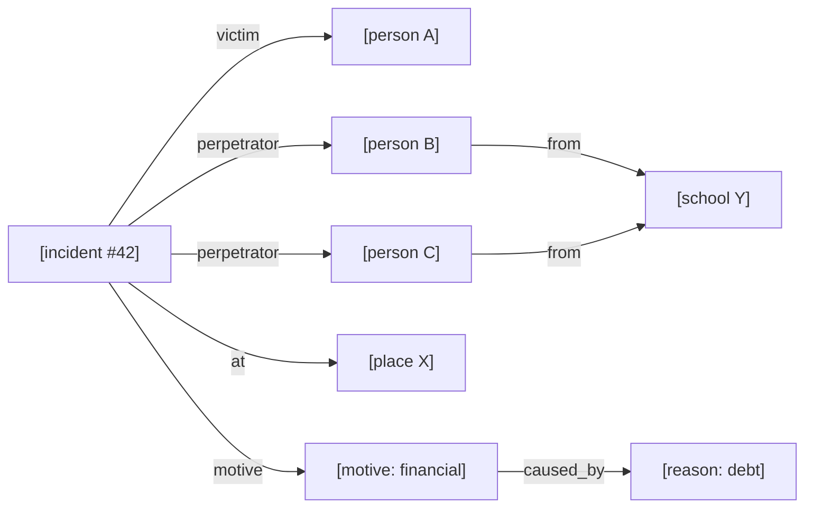
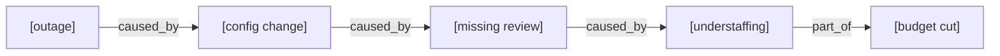
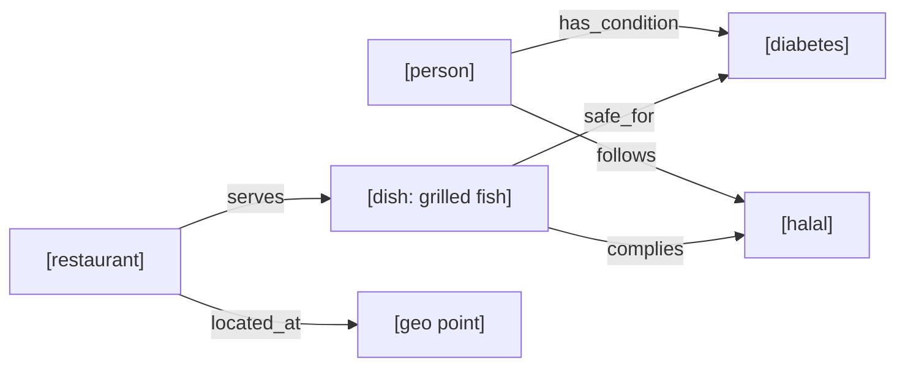
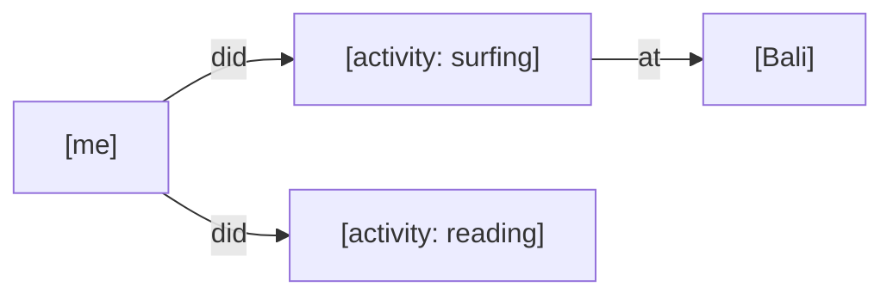
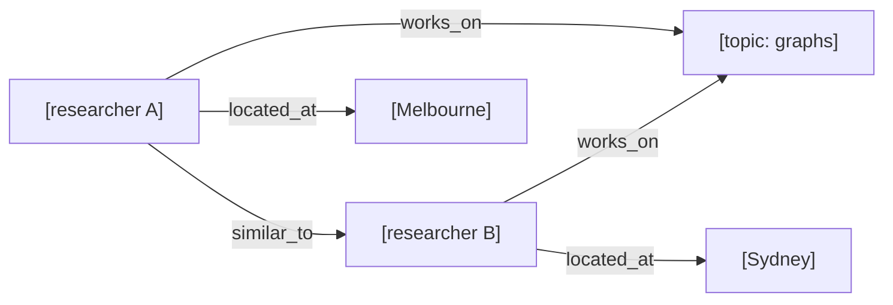
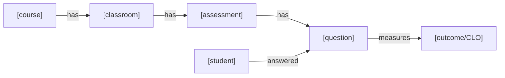

# Edge Design — A Cross-Domain Thought Experiment

sekejap is one engine used across many kinds of projects. If we design the edge
from a single domain we'll overfit. So this document walks the *same question* —
**"what does an edge actually need to carry?"** — through six representative
domains, illustrates each, and only then synthesizes the shape.

**Notation.** Nodes are `[boxes]`; edges are typed arrows; an edge's qualifiers are
shown in an *edge-card* `⟨ key: value, … ⟩`. Structure is drawn with mermaid; the
edge-card sits beside it, because that's the part today's graphs render poorly.

---

## 1. Criminology / Incident Intelligence

An incident is *n-ary* (victim, several perpetrators, place, time, motives), so the
incident itself is a **node**; edges hang off it and stay binary.



Now interrogate one edge — `[incident] —perpetrator→ [person B]`. It was *extracted
from news*, so it isn't a fact, it's a **claim**:

```
[incident #42] —perpetrator→ [person B]
   ⟨ confidence: 0.82,          # extraction isn't certain
     status: charged,           # alleged → charged → convicted → acquitted (evolves)
     role: principal,           # vs accomplice (person C = getaway → accomplice)
     event_time: 2024-03-03,    # when it happened
     asserted_time: 2024-03-05, # when we learned it (bitemporal!)
     polarity: asserted,        # another source may ASSERT the negation
     sources: [reuters, ap] ⟩   # grows as more news corroborates
```

**What this domain demands of edges:** confidence, an evolving categorical status,
a role, *two* timestamps, polarity, and a growing provenance set.

---

## 2. Root-Cause Analysis (the long causal chain)

RCA is criminology's engine generalized: few edge *types* (`caused_by`, `part_of`,
`enables`), traversed *deep*, each carrying a confidence that must **multiply along
the path** so the whole explanation gets a score.



```
[outage] —caused_by→ [config change]   ⟨ confidence: 0.9 ⟩
[config change] —caused_by→ [missing review] ⟨ confidence: 0.7 ⟩
[missing review] —caused_by→ [understaffing]  ⟨ confidence: 0.6 ⟩

whole-chain confidence = 0.9 × 0.7 × 0.6 = 0.38   ← PATH_PRODUCT(confidence)
answer: "38% sure the outage traces to understaffing, via missing review"
```

**Demands:** *one* numeric qualifier (confidence) that isn't just filterable — it's a
**weight multiplied along paths**. This is what makes the answer *white-box*.

---

## 3. Healthy Living (spatial + conjunctive constraints)

Here edges are **compatibility/scored** links, and the recommendation must satisfy
*several* constraints at once (health AND religion AND budget AND distance).



```
[dish] —safe_for→ [diabetes]   ⟨ safety: 0.95, evidence: clinical ⟩
[dish] —complies→ [halal]      ⟨ certainty: 1.0, certifier: MUI ⟩
[restaurant] —located_at→ [geo] (distance derived at query time: 1.2 km)
```

**Demands:** a numeric fit-score per edge, but note — the *final* ranking weight
(distance × price × safety × compliance) is **derived at query time** from many
edges + node fields, not stored on any one edge. So some "edge weight" is a **score
expression**, not a column.

---

## 4. Spatiotemporal Diary / Life-log

The edge's center of gravity is **time**. "What did I do most around 1993?"



```
[me] —did→ [surfing]  ⟨ when: 1993-07-14, duration_min: 120, count: 37 ⟩
```

**Demands:** a timestamp column (grouping/bucketing by time) and simple numeric
aggregables (duration, count). Same `did` edge type, aggregated over a time window.

---

## 5. Research Clustering / Similarity (incl. related-artist discovery)

Edges here are **derived, weighted, often symmetric** similarity links whose weight
is a blend of several factors.



```
[A] —similar_to→ [B]
   ⟨ similarity: 0.71,               # the thing you rank on
     topic_overlap: 0.6, geo_km: 700, coauthored: 2 ⟩   # its ingredients
```

**Demands:** a primary numeric (similarity) *plus* its component factors, all
typed and aggregatable ("most-researched topics" = group over `works_on` edges).
Again the primary weight may be **stored** (precomputed) *or* **derived** on the fly.

---

## 6. Outcome-Based Education (the aggregation tree)

Edges form a composition tree; the query rolls a numeric **up** the tree.



```
[student] —answered→ [question]   ⟨ score: 87, attempts: 2, at: 2026-05-01 ⟩
[question] —measures→ [outcome]   ⟨ weight: 0.4 ⟩

rollup: AVG(answered.score) grouped by outcome, weighted by measures.weight
```

**Demands:** numeric qualifiers on *two different edge types* (`score` on
`answered`, `weight` on `measures`), grouped and averaged. The qualifiers differ per
edge type — `answered` has no "legal status"; `perpetrator` has no "score".

---

## Cross-domain synthesis — what the edge *should* be

Laying the six side by side, patterns fall out that no single domain shows:

### Observation A — every domain wants a *few* typed qualifiers, but *which* ones differ
| Domain | Hot edge qualifiers |
|---|---|
| Criminology | confidence, status, role, event_time, polarity |
| RCA | confidence (path-multiplied) |
| Healthy living | safety, compliance, (derived: distance, price-fit) |
| Diary | when, duration, count |
| Similarity | similarity, topic_overlap, geo_km |
| Education | score, attempts, weight |

→ You **cannot** hardcode a universal qualifier set. `answered` needs `score`;
`perpetrator` needs `status`. **The typed qualifiers are per-edge-type → this argues
for an edge *schema* (declare the columns per type), not one fixed `strength`.**

### Observation B — one qualifier is special: the *path weight*
confidence (RCA), similarity (clustering), safety (health), score (education) — each
domain has **one** numeric that gets **multiplied/aggregated along paths** to score a
whole traversal. This is the `strength` role generalized: not a fixed field named
"strength", but *whichever declared column the edge type nominates as its weight*.

### Observation C — time is nearly universal
event_time (criminology, diary), asserted_time (criminology), `at`/`when` (diary,
education), historical validity (similarity of band-members-over-time). **TIMESTAMP
qualifiers on edges are broadly needed** — the substrate for time-scoped traversal
("causes as of March", "activities in 1993").

### Observation D — two natures of weight: stored vs derived
- **Stored**: score, confidence, similarity-precomputed — a column on the edge.
- **Derived**: final health-fit = f(distance, price, safety…) computed at query time
  from many edges + node fields. → the engine must let a **score expression** treat
  edge columns as inputs, not only stored values. (This is hybrid scoring, applied to
  edges.)

### Observation E — provenance / evidence is a *bag*, not a column
sources[], extracted sentence, certifier, notes. Rarely filtered in bulk; fine to be
a flexible, slower blob off the hot path.

### Observation F — identity & accumulation
Two articles asserting the same link = **one** edge whose provenance grows and whose
confidence rises (corroboration) — not two duplicates. Conflicting articles = one
edge that records the dispute. → `(from, to, type)` identity with **upsert +
accumulation**, not silent parallel edges.

### Observation G — occasionally, a claim about a claim
"investigator disputed the *perpetrator* claim" — an edge targeting an edge
(reification). Rare, but the domain (news, law, science) produces it. An edge may
need **optional self-identity** so it can be a traversal target.

---

## The edge shape, concluded

An edge should be **three-natured**, with the qualifier tier being *declared per type*:

```
┌── STRUCTURE ────────────────────────────────────────────── (featherweight, always)
│   from ──type──▶ to                       traversed constantly → index-free, tiny
├── TYPED QUALIFIERS ─────────────────────── (declared per edge type; a handful)
│   e.g. answered  ⟨ score REAL, attempts INT, at TIMESTAMP ⟩
│        perpetrator ⟨ confidence REAL [WEIGHT], status ENUM, event_time TIMESTAMP ⟩
│   → filterable, groupable, aggregatable, path-multipliable, TIMESTAMP-aware
├── PROVENANCE BAG ───────────────────────── (arbitrary JSON, off the hot path)
│   ⟨ sources: […], sentence: "…", notes: "…" ⟩
└── OPTIONAL IDENTITY ────────────────────── (so a claim can be a target)
```

Rules the six domains agree on:
1. **A small set of *declared, typed* qualifiers per edge type** — not one fixed
   `strength`, not an arbitrary document. (Observation A.)
2. **One nominated column is the *path weight*** — multiplied/aggregated along
   traversals for white-box scoring. (Observation B.)
3. **First-class `TIMESTAMP` qualifiers.** (Observation C.)
4. **Edge columns usable inside score expressions** (stored *and* derived weights).
   (Observation D.)
5. **A JSON provenance bag** for the messy evidence. (Observation E.)
6. **`(from,to,type)` identity with upsert + accumulation.** (Observation F.)
7. **Optional edge identity** for reified "claims about claims." (Observation G.)

### Where this sits vs the field
- **Not Neo4j's** open key-value props (untyped, and weight lives in a separate
  algorithms library) — sekejap *declares* qualifier types and makes the weight
  first-class in the query language.
- **Not Arango/Surreal's** "edge = full document" (flexible but every hop pays a
  document fetch) — sekejap keeps structure featherweight and puts only a *handful*
  of typed qualifiers on the fast path.
- **Not Dgraph's** second-class facets (limited, non-indexable).

The sweet spot the domains keep pointing at is the one nobody occupies: **a
lightweight edge that still carries a few *declared, typed, path-aware,
time-aware* qualifiers on the fast path, plus a provenance bag off it.** That is the
generalization of the single `strength` column this document started from
(since generalized: `strength` is an ordinary edge attribute today) — and it's the same shape whether
the edge is a criminal accusation, a causal link, a dietary fit, a diary moment, a
similarity, or a graded answer.
